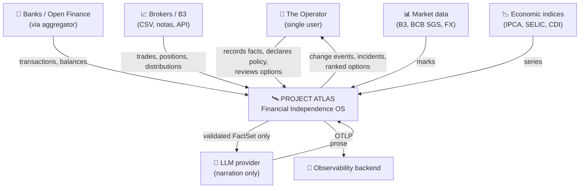
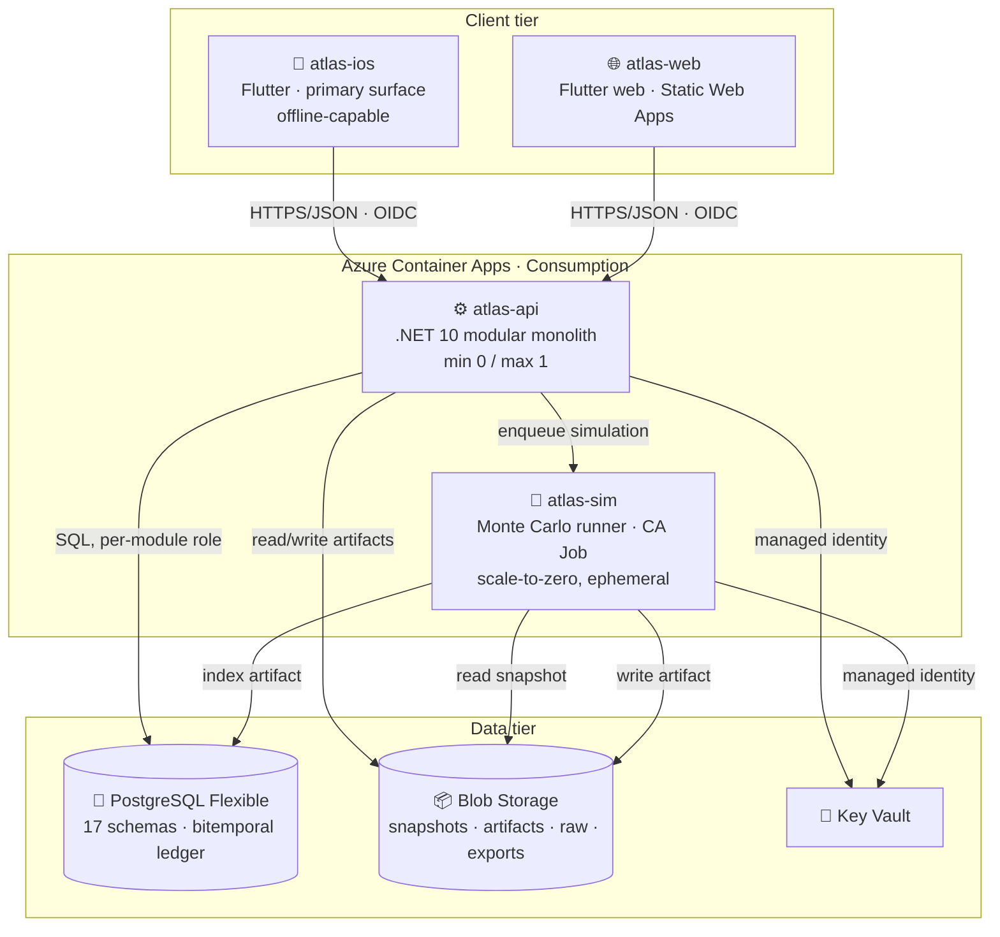
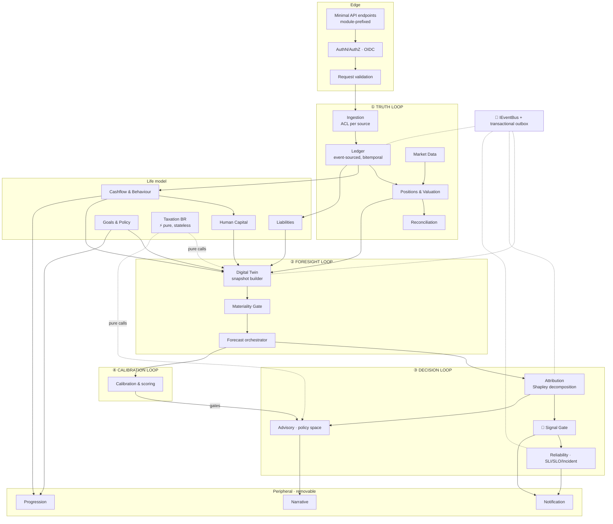
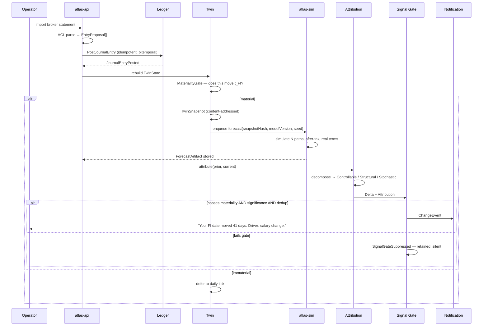

# Container & Component View (C4)

**Status:** Ratified · **Owner:** Principal Architect · **Last reviewed:** 2026-08-01

---

## Level 1 — System context

**Boundaries that define the system:**
- Atlas **never initiates a financial transaction**. Read-only against the outside world (NG-03).
- The LLM sees a `FactSet`, never the ledger (BR-900, BR-906).
- Every inbound integration passes an ACL; no external schema reaches the domain.

---

## Level 2 — Containers

| Container | Tech | Responsibility | Scaling |
|---|---|---|---|
| `atlas-ios` | Flutter / Dart | Mission Control surface, local cache, offline capture | Device |
| `atlas-web` | Flutter web | Secondary surface, deep analysis views | Static CDN |
| `atlas-api` | .NET 10 | All 17 modules, command/query handling, projections, event dispatch | 0 → 1 |
| `atlas-sim` | .NET 10 Job | Path simulation only. Stateless: snapshot in → artifact out | 0 → N |
| PostgreSQL | PG 17 | Truth, intent, projections, indices | Vertical |
| Blob | StorageV2 | Immutable artifacts, raw payloads, exports | Unbounded |

**Why `atlas-sim` is separate.** Not modularity — it is already a module. It is separated because
its resource profile is genuinely different: bursty, CPU-saturating, minutes-long, and it must not
be able to starve the API of memory. It is also the natural extraction point if the numerical stack
ever moves to Python ([Modular Monolith §8](03-modular-monolith.md)).

---

## Level 3 — Components inside `atlas-api`

### Component responsibilities

| Component | Single responsibility | Must not |
|---|---|---|
| Ingestion | Translate external formats into `EntryProposal` | Post to the ledger directly |
| Ledger | Record balanced, bitemporal truth | Value anything, interpret anything |
| Positions | Maintain lots, basis, corporate actions | Apply tax rules |
| Taxation | Compute tax consequences, purely | Hold state, read a clock, do I/O |
| Twin | Assemble a complete, hashed snapshot | Compute forecasts |
| Materiality Gate | Decide whether a state change warrants re-forecast | Decide what the user sees |
| Forecast | Produce immutable artifacts | Compare artifacts, interpret them |
| Attribution | Decompose deltas into classified drivers | Decide user visibility alone |
| **Signal Gate** | Decide what reaches the user | Compute anything |
| Reliability | Evaluate SLIs, manage incidents | Alert on stochastic drivers |
| Advisory | Enumerate and rank policy options | Instruct, or name securities |
| Calibration | Score past forecasts, gate advice | Auto-retune models |
| Progression | Track process adherence | Observe returns or valuations |
| Narrative | Render a `FactSet` as prose | Compute, round, or convert |

**The two gates are the architecture's most important components.** The Materiality Gate controls
*compute cost*; the Signal Gate controls *user attention*. Both are cheap code protecting expensive
resources.

---

## Level 4 — The critical path, sequenced

**Read the failure branches, not the happy path.** Two of the three terminal states are *silence*.
That is the design working: the system's default output is nothing, and speech is earned.

---

## Deployment view

| Unit | Artifact | Trigger | Rollback |
|---|---|---|---|
| `atlas-api` | OCI image (GHCR) | Push to `main`, gates green | Revision revert, < 5 min |
| `atlas-sim` | OCI image (GHCR) | Same | Job version pin |
| `atlas-web` | Static bundle | Same | SWA revision |
| `atlas-ios` | TestFlight build | Tag | Previous build |
| Database | Bicep + module migrations | Deploy-time, advisory-locked | Expand/contract only — never a destructive down-migration |

---

**See also:** [Architecture Vision](01-architecture-vision.md) · [Modular Monolith](03-modular-monolith.md) · [DevOps & CI/CD](09-devops-and-cicd.md)
